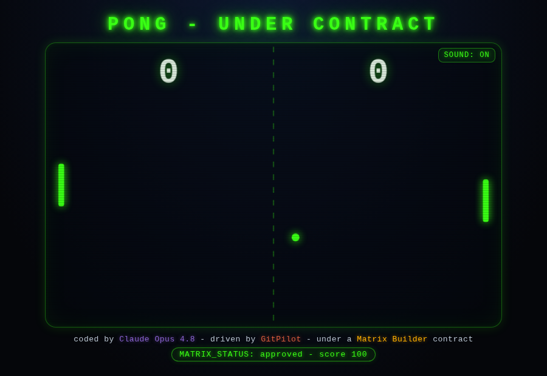

<div align="center">

<h1>🕹️ Pong — Under Contract</h1>
<h3>An AI wrote this neon Pong — under contract, with proof.</h3>

<p><b>Claude Opus 4.8</b>, driven by <a href="https://gitpilot.ruslanmv.com">GitPilot</a>, wrote <code>frontend/index.html</code> — and <i>only</i> that file — bound by a <a href="https://github.com/agent-matrix/matrix-builder">Matrix Builder</a> contract, then validated by <code>mb check</code> <b>before</b> the change could land.</p>

<p>
  <a href="https://ruslanmv.com/pong-under-contract/"></a>
  &nbsp;
  <a href="EVIDENCE.md"></a>
</p>

<p>
  
  
  
  
</p>



</div>

---

## 🎮 [Play it now → ruslanmv.com/pong-under-contract](https://ruslanmv.com/pong-under-contract/)

No install, no build — one self-contained HTML file an AI wrote. Beat the CPU to **11**.
**Move:** `W`/`S`, arrows, or touch the left half. **Pause:** `P`.

---

## How it was built — under contract

`frontend/index.html` was generated by **Claude Opus 4.8** through GitPilot's `generate` path, bound by a **Matrix Builder** contract (allow-list: `frontend/index.html` only), then validated:

```text
$ mb check frontend/index.html
MATRIX_STATUS: approved  score=100
  committed mc-caf49981d56a
```

Full transcript in [`EVIDENCE.md`](EVIDENCE.md). The model touched **only** the allowed file — provably.

## Build it yourself

```bash
pip install agent-generator gitcopilot crewai
export GITPILOT_PROVIDER=claude GITPILOT_CLAUDE_MODEL=claude-opus-4-8 ANTHROPIC_API_KEY=sk-ant-...
mb init "a neon Pong game" --quality standard && mb next "build it" && mb prompt --coder gitpilot
gitpilot generate -m "$(cat coder-prompts/gitpilot.md)" -o .
mb check frontend/index.html
```

## Links

- 🧩 Matrix Builder → https://github.com/agent-matrix/matrix-builder
- 🚁 GitPilot → https://gitpilot.ruslanmv.com
- ⚙️ Engine + `mb` → https://github.com/ruslanmv/agent-generator
- ✍️ The write-up → https://ruslanmv.com/blog/pong-under-contract/

<div align="center"><sub>Built by <a href="https://ruslanmv.com">Ruslan Magana Vsevolodovna</a> · MIT licensed</sub></div>
